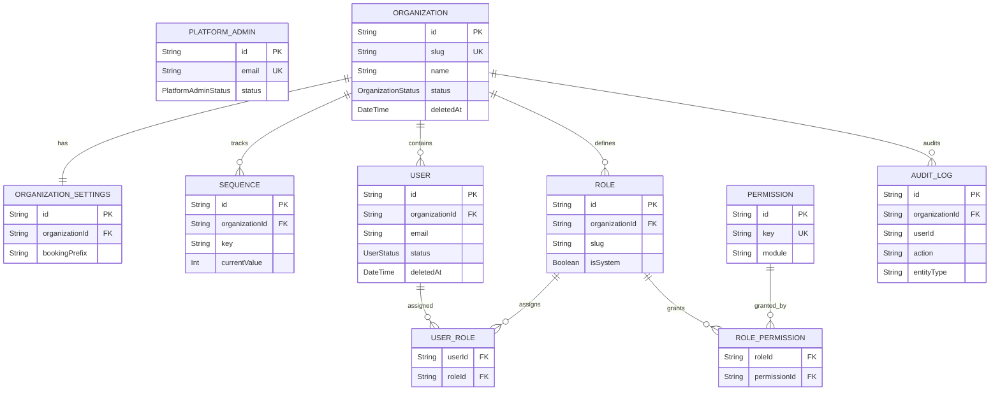

# Phase 02 ERD

```mermaid
erDiagram
    PLATFORM_ADMIN {
        String id PK
        String email UK
        PlatformAdminStatus status
    }

    ORGANIZATION {
        String id PK
        String slug UK
        String name
        OrganizationStatus status
        DateTime deletedAt
    }

    ORGANIZATION_SETTINGS {
        String id PK
        String organizationId FK
        String bookingPrefix
    }

    SEQUENCE {
        String id PK
        String organizationId FK
        String key
        Int currentValue
    }

    USER {
        String id PK
        String organizationId FK
        String email
        UserStatus status
        DateTime deletedAt
    }

    ROLE {
        String id PK
        String organizationId FK
        String slug
        Boolean isSystem
    }

    PERMISSION {
        String id PK
        String key UK
        String module
    }

    ROLE_PERMISSION {
        String roleId FK
        String permissionId FK
    }

    USER_ROLE {
        String userId FK
        String roleId FK
    }

    AUDIT_LOG {
        String id PK
        String organizationId FK
        String userId
        String action
        String entityType
    }

    ORGANIZATION ||--|| ORGANIZATION_SETTINGS : has
    ORGANIZATION ||--o{ SEQUENCE : tracks
    ORGANIZATION ||--o{ USER : contains
    ORGANIZATION ||--o{ ROLE : defines
    ORGANIZATION ||--o{ AUDIT_LOG : audits
    
    ROLE ||--o{ ROLE_PERMISSION : grants
    PERMISSION ||--o{ ROLE_PERMISSION : granted_by
    
    USER ||--o{ USER_ROLE : assigned
    ROLE ||--o{ USER_ROLE : assigns
```
